# Documentación del Sistema Distribuido 2PC

## Índice
1. [Introducción](#1-introducción)
2. [Metodología](#2-metodología)
3. [**Diagramas de Flujo**](#3-diagramas-de-flujo)
4. [Arquitectura del Sistema](#4-arquitectura-del-sistema)
5. [Detalles de Implementación](#5-detalles-de-implementación)

---

## 1. Introducción
El sistema implementa una arquitectura distribuida orientada a transacciones financieras simuladas (débito/crédito) entre microservicios bancarios. Se utiliza el protocolo de Dos Fases (2PC) para coordinar la atomicidad de operaciones que involucran más de un participante. La aplicación resuelve los problemas clásicos de consistencia entre nodos, necesidad de una decisión global (commit/abort) y la agregación de características de seguridad (autenticación y autorización por roles) para controlar quién puede iniciar transacciones y realizar tareas administrativas.

### Arquitectura Flexible: Docker y Local
El sistema soporta dos modos de ejecución:
1. **Docker**: Orquestación completa con MySQL y servicios containerizados (modo producción)
2. **Local**: Ejecución nativa con SQLite sin dependencias de Docker (modo desarrollo/pruebas)

Esta flexibilidad permite desarrollo ágil, pruebas rápidas y despliegue en entornos con o sin infraestructura de contenedores.

### Problemas Resueltos
- **Coordinación distribuida**: Múltiples servicios independientes (débito/crédito) bajo una decisión única mediante 2PC.
- **Atomicidad global**: Prevención de commits parciales (si un participante falla en preparar, se aborta globalmente).
- **Tolerancia a fallos**: Registro de transacciones, detección de servicios inalcanzables y reconciliación de estados estancados.
- **Seguridad y autorización**: JWT para autenticación, roles (admin/user) para delimitar operaciones sensibles.
- **Portabilidad**: Ejecución sin Docker usando SQLite, eliminando barreras de infraestructura para desarrollo.
- **Configuración centralizada**: Variables de entorno y archivos JSON para gestión de participantes sin hardcoding.

## 2. Metodología
La implementación se divide en capas y servicios:

### 2.1 Microservicios Bancarios (Bank A / Bank B)

#### Implementaciones Disponibles
1. **Versión Docker** (`app.py`): Usa MySQL con configuración vía variables de entorno
2. **Versión Local** (`app_local.py`): Usa SQLite con inicialización automática de datos de prueba

Cada servicio expone endpoints estándar:
- **`/health`**: Verificación de disponibilidad
- **`/prepare`**: Fase 1 del 2PC - validación sin modificación
- **`/commit`**: Fase 2 del 2PC - aplicación definitiva del cambio
- **`/rollback`**: Cancelación/reversión (placeholder, no implementa locks aún)

#### Lógica de Negocio
- **Bank A (Débito)**: Valida existencia de cuenta origen y saldo suficiente en PREPARE; descuenta en COMMIT
- **Bank B (Crédito)**: Valida existencia de cuenta destino en PREPARE; acredita en COMMIT

#### Datos de Prueba (Versión Local)
**Bank A** (`bank_a.db`):
- Cuenta 1: Balance 1000.0
- Cuenta 2: Balance 500.0

**Bank B** (`bank_b.db`):
- Cuenta 1: Balance 200.0
- Cuenta 2: Balance 800.0

#### Propiedades ACID Aplicadas
- **Atomicidad**: El coordinador decide commit solo si todos responden READY.
- **Consistencia**: Se evita modificación unilateral (aborto si un participante no está listo).
- **Aislamiento**: Pendiente - se planea tabla `prepared_tx` para bloquear recursos.
- **Durabilidad**: Resultados registrados en `TransactionLog` del coordinador; falta replicar en participantes.

### 2.2 Coordinador (Versión Simple en `acid/coordinator/app.py`)
Orquesta la llamada `/transfer` con dos fases: PREPARE y COMMIT, abortando si alguna respuesta es distinta a READY. No persiste decisiones, no implementa reintentos ni timeouts, y está limitado a dos participantes. Sirve como referencia baseline.

### 2.3 API Final (Coordinador Avanzado)
El coordinador avanzado implementa características empresariales sobre el protocolo 2PC base:

#### Módulos Principales
- **`app.py`**: API FastAPI con endpoints de autenticación, transferencia, consulta y administración
- **`participant.py`**: Abstracción de participantes con reintentos configurables y manejo de errores
- **`transaction.py`**: Servicio de alto nivel para operaciones transaccionales y reconciliación
- **`security.py`**: Hashing bcrypt de contraseñas y generación/validación de tokens JWT
- **`models.py`**: Modelos SQLModel (User, TransactionLog, BalanceCache)
- **`config.py`**: Gestión centralizada de configuración con soporte Docker/Local
- **`database.py`**: Motor SQLite y context manager para sesiones

#### Configuración Flexible
**Modos de Ejecución**:
- `ENV_MODE=docker`: Usa hostnames internos (`bank_a_api:8000`, `bank_b_api:8000`)
- `ENV_MODE=local`: Usa localhost con puertos mapeados (`localhost:8001`, `localhost:8002`)

**Fuentes de Configuración** (orden de prioridad):
1. Variable de entorno `BANK_PARTICIPANTS` (formato: `nombre|url|rol,nombre|url|rol`)
2. Archivo `participants.json` (JSON array con objetos {name, url, role})
3. Fallback automático según `ENV_MODE`

#### Endpoints Disponibles
**Autenticación**:
- `POST /auth/login`: Obtener token JWT (usuario: admin/admin)
- `POST /auth/register`: Crear nuevo usuario (requiere rol admin)

**Operaciones Transaccionales**:
- `POST /transfer`: Iniciar transferencia 2PC
- `GET /transactions`: Listar transacciones recientes
- `GET /transactions/{tx_id}`: Detalle de transacción específica
- `GET /balance/{account_id}`: Consulta de balance (placeholder)

**Administración**:
- `POST /admin/reconcile`: Abortar transacciones PREPARED antiguas (requiere rol admin)
- `GET /health`: Estado del coordinador y participantes configurados

### 2.4 Seguridad

#### Autenticación y Autorización
- **JWT (JSON Web Tokens)**: Autenticación stateless con expiración configurable (default 120 minutos)
- **Roles**: Sistema de permisos (admin, user) para control granular de operaciones
- **Bcrypt**: Hashing seguro de contraseñas (versión 4.0.1 por compatibilidad)

#### Flujo de Seguridad
1. **Login**: Usuario envía credenciales → Servidor valida → Retorna JWT
2. **Operación Protegida**: Cliente incluye JWT en header `Authorization: Bearer <token>`
3. **Validación**: Middleware verifica firma, expiración y extrae claims (usuario, rol)
4. **Autorización**: Decoradores `require_role()` validan permisos necesarios

#### Endpoints Protegidos
- **Requieren autenticación**: `/transfer`, `/transactions`, `/balance`
- **Requieren rol admin**: `/auth/register`, `/admin/reconcile`

#### Configuración de Seguridad
En `.env` o variables de entorno:
```bash
JWT_SECRET=change-me          # Secreto para firmar tokens (cambiar en producción)
JWT_ALG=HS256                  # Algoritmo de firma
JWT_EXP_MIN=120                # Tiempo de expiración en minutos
```

#### Usuario por Defecto
Creado automáticamente al iniciar:
- **Usuario**: admin
- **Contraseña**: admin
- **Rol**: admin

** Importante**: Cambiar credenciales por defecto en entornos de producción.

### 2.5 Replicación y Consistencia
La base para replicar consiste en tener múltiples bancos que reflejan operaciones complementarias. Para verdadera replicación activa (mismo estado en N nodos) se agregaría un tercer participante tipo "mirror" que aplicaría tanto el débito como el crédito o un snapshot consolidado. El coordinador avanzado ya acepta configuración de múltiples participantes vía variable de entorno `BANK_PARTICIPANTS`.

### 2.6 Tolerancia a Fallos y Recuperación
Actualmente, ante fallo en PREPARE o COMMIT se aborta y se ejecuta un rollback de mejor esfuerzo. La reconciliación marca transacciones PREPARED viejas como ABORTED para evitar bloqueos lógicos. Se propone como mejora: persistir PREPARE y usar log durable de decisiones para reintentos en caso de caída.

---

## 3. Diagramas de Flujo

### 3.1 Arquitectura General del Sistema

```mermaid
graph TB
    subgraph Cliente
        USER[Usuario/PowerShell]
    end
    
    subgraph Coordinador["API Final (Puerto 9000)"]
        AUTH[auth/login<br/>auth/register]
        TRANSFER[/transfer]
        ADMIN[/admin/reconcile]
        HEALTH[/health]
        
        subgraph Servicios Internos
            SEC[security.py<br/>JWT + Bcrypt]
            TXN[transaction.py<br/>Lógica 2PC]
            PART[participant.py<br/>HTTP Client]
            DB[(transactions.db<br/>SQLite)]
        end
    end
    
    subgraph Participantes
        BA[Bank A<br/>Puerto 8001<br/>Débito]
        BB[Bank B<br/>Puerto 8002<br/>Crédito]
        
        DBA[(bank_a.db<br/>SQLite)]
        DBB[(bank_b.db<br/>SQLite)]
    end
    
    USER -->|1. POST /auth/login| AUTH
    AUTH -->|JWT Token| USER
    USER -->|2. POST /transfer| TRANSFER
    
    TRANSFER --> SEC
    SEC -->|Valida Token| TRANSFER
    TRANSFER --> TXN
    
    TXN -->|3. FASE 1: PREPARE| PART
    PART -->|HTTP POST| BA
    PART -->|HTTP POST| BB
    
    BA --> DBA
    BB --> DBB
    
    BA -->|READY/ABORT| PART
    BB -->|READY/ABORT| PART
    
    PART -->|4. FASE 2: COMMIT/ROLLBACK| BA
    PART -->|COMMIT/ROLLBACK| BB
    
    TXN --> DB
    DB -->|Log Transacción| TXN
    TXN -->|Resultado Final| USER
    
    style Coordinador fill:#e1f5ff
    style Participantes fill:#fff4e6
    style Cliente fill:#f0f0f0
    style DB fill:#ffebee
    style DBA fill:#ffebee
    style DBB fill:#ffebee
```

### 3.2 Flujo Detallado del Protocolo 2PC - Caso Exitoso


### 3.3 Flujo Detallado del Protocolo 2PC - Caso con Fallo


### 3.4 Ciclo de Vida de una Transacción

```mermaid
stateDiagram-v2
    [*] --> INITIATED: Usuario envía /transfer
    
    INITIATED --> PREPARING: Coordinador inicia Fase 1
    
    PREPARING --> READY_ALL: Todos respondieron READY
    PREPARING --> ABORT_PARTIAL: Al menos uno respondió ABORT
    PREPARING --> ABORT_TIMEOUT: Timeout o error de red
    
    READY_ALL --> COMMITTING: Coordinador envía COMMIT
    
    COMMITTING --> COMMITTED: Todos aplicaron cambios
    COMMITTING --> PARTIAL_COMMIT: Algunos fallaron (Estado inconsistente)
    
    ABORT_PARTIAL --> ROLLING_BACK: Coordinador envía ROLLBACK
    ABORT_TIMEOUT --> ROLLING_BACK
    PARTIAL_COMMIT --> ROLLING_BACK: Intento de recuperación
    
    ROLLING_BACK --> ABORTED: Rollback completo
    ROLLING_BACK --> FAILED: Rollback falló (Requiere intervención)
    
    COMMITTED --> [*]: Transacción exitosa
    ABORTED --> [*]: Transacción cancelada
    FAILED --> [*]: Requiere reconciliación manual
    
    note right of PARTIAL_COMMIT
        Estado peligroso:
        Algunos participantes
        committearon, otros no
    end note
    
    note right of FAILED
        Requiere ejecutar:
        POST /admin/reconcile
    end note
```



### 3.5 Flujo de Autenticación y Autorización


### 3.6 Proceso de Inicio de Servicios (Local)

```mermaid
flowchart TD
    START([Inicio de Sistema])
    
    CHECK_ENV{¿ENV_MODE<br/>configurado?}
    SET_LOCAL[Establecer ENV_MODE=local]
    
    CHECK_RESET{¿Reiniciar<br/>bases de datos?}
    RESET[python reset_databases.py]
    
    START_BANKS[Iniciar Servicios Bancarios]
    
    START_A[uvicorn bank_a.app_local:app<br/>--port 8001]
    START_B[uvicorn bank_b.app_local:app<br/>--port 8002]
    
    WAIT[Esperar 4 segundos]
    
    START_API[Iniciar API Final]
    START_COORD[uvicorn app:app<br/>--port 9000]
    
    VERIFY{Verificar<br/>servicios}
    
    HEALTH_A[GET http://localhost:8001/health]
    HEALTH_B[GET http://localhost:8002/health]
    HEALTH_C[GET http://localhost:9000/health]
    
    ALL_OK{¿Todos<br/>responden?}
    
    READY([Sistema Listo])
    ERROR([Error: Revisar logs])
    
    START --> CHECK_ENV
    CHECK_ENV -->|No| SET_LOCAL
    CHECK_ENV -->|Sí| CHECK_RESET
    SET_LOCAL --> CHECK_RESET
    
    CHECK_RESET -->|Sí| RESET
    CHECK_RESET -->|No| START_BANKS
    RESET --> START_BANKS
    
    START_BANKS --> START_A
    START_BANKS --> START_B
    START_A --> WAIT
    START_B --> WAIT
    
    WAIT --> START_API
    START_API --> START_COORD
    
    START_COORD --> VERIFY
    
    VERIFY --> HEALTH_A
    VERIFY --> HEALTH_B
    VERIFY --> HEALTH_C
    
    HEALTH_A --> ALL_OK
    HEALTH_B --> ALL_OK
    HEALTH_C --> ALL_OK
    
    ALL_OK -->|| READY
    ALL_OK -->|| ERROR
    
    style START fill:#e3f2fd
    style READY fill:#c8e6c9
    style ERROR fill:#ffcdd2
    style VERIFY fill:#fff9c4
    style CHECK_RESET fill:#f3e5f5
```

### 3.7 Manejo de Errores y Recuperación


### 3.8 Estructura de Componentes del Sistema


---

## 4. Resultados y Validación

### Entorno de Pruebas
**Sistema operativo**: Windows 10/11  
**Lenguaje**: Python 3.8+  
**Base de datos**: SQLite 3 (modo local) / MySQL 8.0 (modo Docker)  
**Framework**: FastAPI 0.104+  
**Ejecución**: 3 servicios independientes (Bank A:8001, Bank B:8002, API Final:9000)

### 3.1 Pruebas Básicas de Flujo Exitoso VERIFICADO

#### Procedimiento
1. Iniciar servicios locales (Bank A, Bank B, API Final)
2. Obtener token JWT:
   ```powershell
   POST http://localhost:9000/auth/login
   Body: {"username":"admin","password":"admin"}
   ```
3. Ejecutar transferencia:
   ```powershell
   POST http://localhost:9000/transfer
   Headers: Authorization: Bearer <token>
   Body: {"amount":50,"from_account":1,"to_account":2}
   ```

#### Resultado Esperado
```json
{
  "tx_id": "4639a972-4321-432c-afb9-1112622675aa",
  "status": "COMMITTED",
  "participants": [
    {
      "name": "bank_a",
      "role": "debit",
      "url": "http://localhost:8001",
      "prepare_status": "READY",
      "commit_status": "COMMITTED",
      "error": null
    },
    {
      "name": "bank_b",
      "role": "credit",
      "url": "http://localhost:8002",
      "prepare_status": "READY",
      "commit_status": "COMMITTED",
      "error": null
    }
  ]
}
```

#### Verificación
- Estado final: `COMMITTED`
- Ambos participantes: `prepare_status: READY`
- Ambos participantes: `commit_status: COMMITTED`
- Sin errores reportados
- Transacción registrada en `TransactionLog`

### 3.2 Prueba de Falla en PREPARE (Saldo Insuficiente)

#### Escenario
Transferencia que excede el saldo disponible en la cuenta origen.

#### Procedimiento
```powershell
POST http://localhost:9000/transfer
Headers: Authorization: Bearer <token>
Body: {"amount":5000,"from_account":1,"to_account":2}
```

#### Comportamiento Esperado
1. Bank A ejecuta `/prepare` y detecta saldo insuficiente (cuenta 1 tiene 1000)
2. Bank A responde `{"status": "ABORT"}`
3. Coordinador detecta respuesta negativa y aborta globalmente
4. No se ejecuta fase COMMIT
5. Estado final: `ABORTED`

#### Resultado
```json
{
  "tx_id": "uuid-generado",
  "status": "ABORTED",
  "participants": [
    {
      "name": "bank_a",
      "prepare_status": "ABORT",
      "commit_status": null
    },
    {
      "name": "bank_b",
      "prepare_status": "READY",
      "commit_status": null
    }
  ]
}
```

#### Verificación
- Coordinador detecta `ABORT` en fase PREPARE
- No se ejecuta fase COMMIT
- Balances permanecen inalterados
- Transacción registrada como `ABORTED`

### 3.3 Prueba de Falla en COMMIT

#### Escenario
Fallo de un participante durante la fase COMMIT (después de responder READY en PREPARE).

#### Procedimiento
1. Iniciar transferencia pequeña (amount: 20)
2. Durante ejecución, detener Bank B:
   ```powershell
   Get-Process python | Where-Object {$_.CommandLine -like "*8002*"} | Stop-Process -Force
   ```
3. Observar comportamiento del coordinador

#### Comportamiento Esperado
1. Fase PREPARE: Ambos bancos responden `READY`
2. Fase COMMIT: Bank A completa exitosamente
3. Bank B: Timeout o conexión rechazada
4. Coordinador detecta fallo parcial
5. Ejecuta `/rollback` en Bank A (best-effort)
6. Estado final: `ABORTED`

#### Resultado
```json
{
  "tx_id": "uuid-generado",
  "status": "ABORTED",
  "participants": [
    {
      "name": "bank_a",
      "prepare_status": "READY",
      "commit_status": "COMMITTED"
    },
    {
      "name": "bank_b",
      "prepare_status": "READY",
      "commit_status": "ERROR",
      "error": "Connection refused / Timeout"
    }
  ]
}
```

#### Implicaciones
- Commit parcial detectado pero no revertido automáticamente (falta implementación de locks)
- Coordinador registra error y estado ABORTED
- Rollback invocado (aunque sin efecto real sin tabla `prepared_tx`)
- Requiere reconciliación manual o implementación de commit log durable

#### Recuperación
```powershell
# Reiniciar Bank B
cd "c:\...\acid\bank_b"
Start-Process python -ArgumentList "-m","uvicorn","app_local:app","--host","127.0.0.1","--port","8002"
```

### 3.4 Servicio No Disponible (Bank A o Bank B Caído Antes de PREPARE)

#### Escenario
Participante completamente inaccesible antes de iniciar la transacción.

#### Procedimiento
1. Detener Bank A:
   ```powershell
   Get-Process python | Where-Object {$_.CommandLine -like "*8001*"} | Stop-Process -Force
   ```
2. Intentar transferencia:
   ```powershell
   POST http://localhost:9000/transfer
   Body: {"amount":30,"from_account":1,"to_account":2}
   ```

#### Comportamiento
1. Coordinador intenta contactar Bank A para PREPARE
2. Tras reintentos configurados (max_retries=2), marca como `UNREACHABLE`
3. Detecta que no todos están READY
4. Aborta transacción sin ejecutar COMMIT en ningún participante
5. Estado final: `ABORTED`

#### Resultado
```json
{
  "tx_id": "uuid-generado",
  "status": "ABORTED",
  "participants": [
    {
      "name": "bank_a",
      "prepare_status": "UNREACHABLE",
      "commit_status": null,
      "error": "Max retries exceeded: Connection refused"
    },
    {
      "name": "bank_b",
      "prepare_status": "READY",
      "commit_status": null
    }
  ]
}
```

#### Verificación
- Coordinador maneja servicios inalcanzables gracefully
- No se ejecuta commit parcial
- Participantes disponibles no quedan en estado inconsistente
- Error descriptivo registrado para debugging

### 3.5 Consistencia tras Abortos

#### Objetivo
Validar que las transacciones abortadas no modifican el estado de las bases de datos participantes.

#### Procedimiento
1. Registrar balances iniciales
2. Ejecutar 5 transferencias que resulten en ABORT (saldo insuficiente)
3. Consultar balances finales
4. Comparar valores

#### Comandos de Verificación
```powershell
# Balance inicial Bank A
cd "c:\...\acid\bank_a"
python -c "import sqlite3; conn = sqlite3.connect('bank_a.db'); print(conn.execute('SELECT * FROM accounts').fetchall())"

# Ejecutar múltiples transferencias fallidas
1..5 | ForEach-Object {
    $body = @{amount=9999; from_account=1; to_account=2} | ConvertTo-Json
    Invoke-RestMethod -Uri "http://localhost:9000/transfer" -Method Post -Headers $headers -Body $body -ContentType "application/json"
}

# Balance final Bank A (debe ser idéntico)
python -c "import sqlite3; conn = sqlite3.connect('bank_a.db'); print(conn.execute('SELECT * FROM accounts').fetchall())"
```

#### Resultado Esperado
- Cuenta 1: 1000.0 (sin cambios)
- Cuenta 2: 500.0 (sin cambios)
- Todas las transacciones en estado `ABORTED`
- Ninguna modificación en tablas `accounts`

#### Verificación Adicional
```powershell
# Consultar log de transacciones abortadas
$txList = Invoke-RestMethod -Uri "http://localhost:9000/transactions?limit=10" -Headers $headers
$aborted = $txList | Where-Object {$_.status -eq 'ABORTED'}
Write-Host "Transacciones abortadas: $($aborted.Count)"
```

#### Conclusión
El sistema preserva consistencia: transacciones abortadas no persisten cambios en participantes.

### 3.6 Reconciliación de Transacciones Estancadas

#### Objetivo
Resolver transacciones en estado `PREPARED` que no avanzaron a `COMMITTED` o `ABORTED` (e.g., por caída del coordinador).

#### Escenario
Coordinador cae después de PREPARE exitoso pero antes de COMMIT. Al reiniciar, quedan transacciones "colgadas" en estado PREPARED.

#### Procedimiento
1. Simular transacción estancada (inserción manual en DB):
   ```powershell
   cd "c:\...\API final"
   python -c @"
   import sqlite3
   from datetime import datetime, timedelta
   conn = sqlite3.connect('transactions.db')
   old_time = (datetime.utcnow() - timedelta(minutes=10)).isoformat()
   conn.execute(
       'INSERT INTO transactionlog (tx_id, status, participants, created_at, updated_at) VALUES (?, ?, ?, ?, ?)',
       ('test-stuck-tx-001', 'PREPARED', '[]', old_time, old_time)
   )
   conn.commit()
   print('Transacción PREPARED simulada insertada')
   "@
   ```

2. Ejecutar reconciliación:
   ```powershell
   POST http://localhost:9000/admin/reconcile
   Headers: Authorization: Bearer <admin-token>
   ```

#### Resultado Esperado
```json
{
  "performed": [
    {
      "tx_id": "test-stuck-tx-001",
      "action": "ABORTED"
    }
  ]
}
```

#### Verificación
```powershell
# Consultar transacción reconciliada
GET http://localhost:9000/transactions/test-stuck-tx-001
```
Respuesta:
```json
{
  "tx_id": "test-stuck-tx-001",
  "status": "ABORTED",
  "updated_at": "2025-11-24T..."  // Timestamp actualizado
}
```

#### Configuración
- `RECONCILE_INTERVAL_SEC=60`: Edad mínima (segundos) para considerar transacción estancada
- Por defecto: Transacciones PREPARED con más de 5 minutos son marcadas como ABORTED

#### Uso en Producción
- Ejecutar periódicamente vía cron/scheduler
- Monitorear log de reconciliaciones
- Alertar si volumen de estancadas es elevado (indica problema en coordinador)

Mecanismo de auto-sanación para evitar bloqueos indefinidos.

### 3.7 Escenario de Extensión con Tercer Participante

#### Objetivo
Demostrar escalabilidad del protocolo 2PC a más de 2 participantes (replicación, mirror, auditoría).

#### Arquitectura con 3 Nodos
- **Bank A**: Participante débito (sustrae fondos)
- **Bank B**: Participante crédito (agrega fondos)
- **Bank C**: Participante mirror/replica (copia de transacción para auditoría o DR)

#### Procedimiento

##### Opción 1: Crear Bank C como Servicio Real
```powershell
# Duplicar Bank B como base para Bank C
cd "c:\...\acid"
Copy-Item -Recurse bank_b bank_c
cd bank_c

# Editar app_local.py: Cambiar DB_PATH a 'bank_c.db'
# Editar título FastAPI a "Bank C (Mirror Service)"

# Iniciar Bank C
Start-Process python -ArgumentList "-m","uvicorn","app_local:app","--host","127.0.0.1","--port","8003"
```

##### Opción 2: Configurar vía Variable de Entorno
```powershell
# Definir 3 participantes
$env:BANK_PARTICIPANTS="bank_a|http://localhost:8001|debit,bank_b|http://localhost:8002|credit,bank_c|http://localhost:8003|mirror"

# Reiniciar API Final para cargar nueva configuración
Get-Process python | Where-Object {$_.CommandLine -like "*9000*"} | Stop-Process -Force
cd "c:\...\API final"
Start-Process python -ArgumentList "-m","uvicorn","app:app","--host","127.0.0.1","--port","9000"
```

##### Opción 3: Usar Archivo JSON (Recomendado)
```powershell
# Copiar configuración de 3 nodos
cd "c:\...\API final"
Copy-Item participants_3nodes.json participants.json -Force

# Reiniciar coordinador
Get-Process python | Where-Object {$_.CommandLine -like "*9000*"} | Stop-Process -Force
Start-Process python -ArgumentList "-m","uvicorn","app:app","--host","127.0.0.1","--port","9000"
```

#### Ejecutar Transferencia con 3 Participantes
```powershell
Start-Sleep -Seconds 3
$body = @{amount=25; from_account=1; to_account=2} | ConvertTo-Json
$result = Invoke-RestMethod -Uri "http://localhost:9000/transfer" -Method Post -Headers $headers -Body $body -ContentType "application/json"
$result.participants.Count  # Debe retornar 3
```

#### Resultado Esperado
```json
{
  "tx_id": "uuid-generado",
  "status": "COMMITTED",
  "participants": [
    {"name": "bank_a", "role": "debit", "prepare_status": "READY", "commit_status": "COMMITTED"},
    {"name": "bank_b", "role": "credit", "prepare_status": "READY", "commit_status": "COMMITTED"},
    {"name": "bank_c", "role": "mirror", "prepare_status": "READY", "commit_status": "COMMITTED"}
  ]
}
```

#### Verificación
```powershell
# Health check debe mostrar 3 participantes configurados
Invoke-RestMethod -Uri "http://localhost:9000/health"
# Output: {"status":"ok", "participants_configured":3}
```

#### Casos de Uso para Tercer Participante
1. **Replicación**: Mantener copia sincronizada en región secundaria
2. **Auditoría**: Log inmutable de transacciones en servicio independiente
3. **Análítica**: Replicar datos a warehouse sin impactar servicios operacionales
4. **Disaster Recovery**: Participante pasivo que puede activarse si primarios fallan

El coordinador escala transparentemente a N participantes sin cambios de código.

## 4. Conclusiones

### Logros Alcanzados

#### Protocolo 2PC Funcional
**Implementación completa** de las dos fases (PREPARE y COMMIT) con detección de fallos  
**Atomicidad global**: Todos los participantes committed o ninguno  
**Manejo de errores**: Detección de servicios caídos, timeouts, respuestas negativas  
**Rollback automático**: Invocación de reversión ante fallos en COMMIT  

#### Arquitectura Flexible
**Dos modos de ejecución**: Docker (producción) y Local (desarrollo)  
**Base de datos adaptable**: MySQL para Docker, SQLite para desarrollo  
**Configuración centralizada**: Variables de entorno, archivos JSON, fallbacks inteligentes  
**Escalabilidad**: Soporte para N participantes sin cambios de código  

#### Seguridad Empresarial
**Autenticación JWT**: Tokens con expiración configurable  
**Autorización por roles**: Control granular (admin vs user)  
**Hashing seguro**: bcrypt para protección de credenciales  
**Endpoints protegidos**: Middleware de validación en todas las rutas sensibles  

#### Operaciones y Mantenibilidad
**Reconciliación automática**: Limpieza de transacciones estancadas  
**Logging completo**: TransactionLog con snapshot de estados de participantes  
**Health checks**: Monitoreo de disponibilidad de servicios  
**Reintentos configurables**: Tolerancia a fallos transitorios de red  

### Limitaciones Conocidas

#### Protocolo 2PC
**Sin commit log durable**: Coordinador no persiste decisión antes de enviar COMMIT (riesgo en caída del coordinador)  
**Rollback best-effort**: Sin tabla `prepared_tx`, no hay locks reales ni reversión garantizada  
**Blocking protocol**: Participantes quedan bloqueados esperando decisión del coordinador  
**Sin recovery automático**: Coordinador caído requiere intervención manual  

#### Base de Datos
**SQLite en modo local**: No apto para producción (sin concurrencia real)  
**Sin transacciones distribuidas reales**: Falta XA/Two-Phase Commit a nivel de DBMS  
**Sin índices optimizados**: Queries de reconciliación pueden ser lentas con alto volumen  

#### Seguridad
**Credenciales por defecto**: admin/admin debe cambiarse en producción  
**Sin rate limiting**: API vulnerable a ataques de fuerza bruta  
**Sin HTTPS**: Comunicación en texto plano (agregar TLS/SSL)  
**Tokens sin revocación**: No hay lista negra de tokens comprometidos  

### Trabajo Futuro

#### Corto Plazo (Mejoras Inmediatas)
1. **Commit Log Durable**: Persistir decisión de COMMIT antes de notificar participantes
2. **Tabla prepared_tx**: Implementar locks reales en participantes para reversión garantizada
3. **Endpoint /balance real**: Consulta agregada de balances desde participantes
4. **Credenciales seguras**: Cambiar defaults y forzar contraseñas fuertes
5. **Tests automatizados**: Suite de pruebas unitarias y de integración

#### Mediano Plazo (Robustez)
1. **Three-Phase Commit (3PC)**: Eliminar bloqueos indefinidos
2. **Saga Pattern**: Alternativa para long-running transactions
3. **Circuit breaker**: Prevenir cascadas de fallos
4. **Idempotencia**: Garantizar reintentos seguros
5. **Observabilidad**: Métricas (Prometheus), trazas (Jaeger), logs estructurados

#### Largo Plazo (Producción)
1. **Orquestador resiliente**: Kubernetes + health probes + auto-scaling
2. **Base de datos distribuida**: CockroachDB o YugabyteDB para 2PC nativo
3. **Event sourcing**: Log inmutable de eventos para auditoría
4. **CQRS**: Separar escritura (2PC) de lectura (replicas)
5. **Multi-región**: Participantes geográficamente distribuidos con replicación

### Métricas de Éxito
- **Prueba 3.1**: Transferencia exitosa con 2 participantes (COMMITTED)
- **Prueba 3.2**: Detección correcta de saldo insuficiente (ABORTED)
- **Arquitectura flexible**: Ejecución sin Docker lograda
- **Documentación completa**: Guías de ejecución y validación
- **Código modular**: Fácil extensión a 3+ participantes

### Lecciones Aprendidas
1. **2PC es complejo pero potente**: Requiere atención minuciosa a estados y fallos
2. **Flexibilidad de despliegue**: SQLite permite desarrollo ágil sin infraestructura pesada
3. **Configuración externalizada**: Facilita testing y despliegue en múltiples entornos
4. **Seguridad desde diseño**: JWT y roles deben integrarse desde el inicio
5. **Observabilidad crítica**: TransactionLog es esencial para debugging y auditoría

